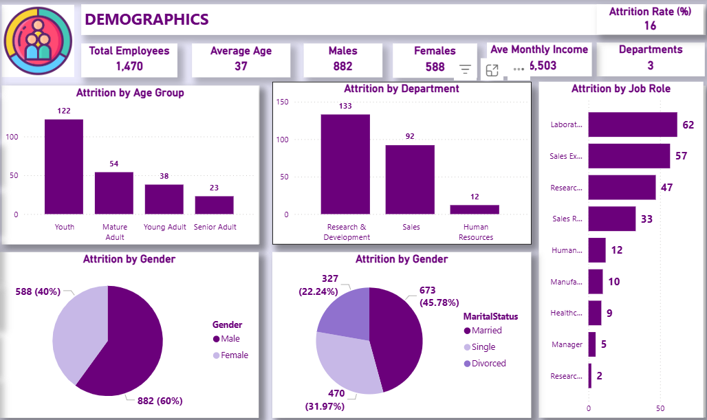
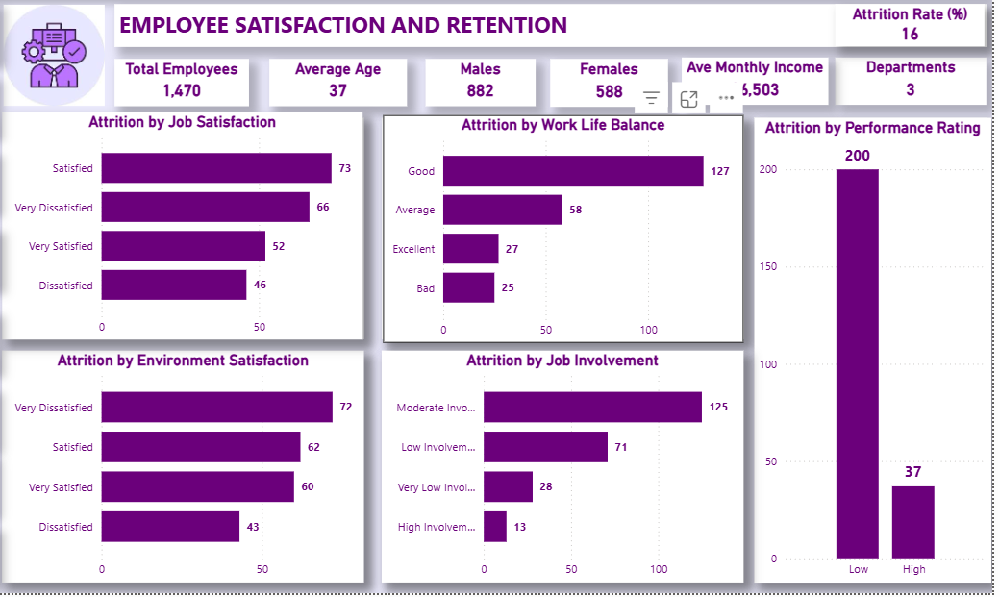
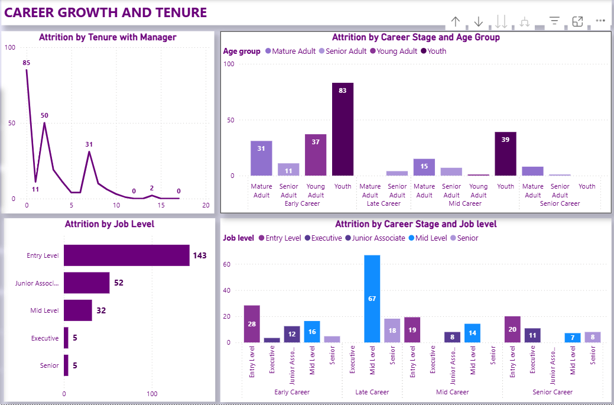

# Employee Attrition
This report summarizes the key findings and recommendations derived from an analysis of employee attrition data, providing insights into demographic patterns, satisfaction levels, and career progression factors influencing turnover.
## **Employee Attrition Analysis Report**

## **Table of Contents**

* [Project Overview](#project-overview)
* [Data Sources](#data-sources)
* [Tools for Analysis](#tools-for-analysis)
* [Data Cleaning, Preparation and Transformation](#data-cleaning-preparation-and-transformation)
* [Results and Findings](#results-and-findings)
   - [Demographics and Attrition](#demographics-and-attrition)
   - [Employee Satisfaction and Retention](#employee-satisfaction-and-retention)
   - [Career Growth and Tenure](#career-growth-and-tenure)
* [Recommendations](#recommendations)
* [Conclusion](#conclusion)

---

## **Project Overview**

This project provides an in-depth analysis of employee attrition using a multi-page Power BI dashboard built from HR employee records.
The goal is to identify **who is leaving**, **why they are leaving**, and **what actions HR can take to improve retention**.

The dashboard includes:

* **Demographics Overview**
* **Employee Satisfaction and Retention**
* **Career Growth and Tenure**

The analysis demonstrates a complete workflow using **Excel, SQL, Power Pivot, and Power BI** — from data cleaning to interactive dashboards and HR insights.

---

## **Data Sources**

* Employee Attrition CSV Dataset from www.kaggle.com

---

## **Tools for Analysis**

* **Microsoft Excel** – data cleaning & preprocessing and **Power Pivot** for calculated columns and measures
* **SQL** – groupings, aggregations, and views
* **Power BI Desktop** – modeling, visualization, and insights

---

## **Data Cleaning, Preparation and Transformation**

* Checked for duplicates and validated employee IDs
* Standardized job roles, education fields and categorical variables
* Created age groups, marital categories, tenure bands, job levels, and satisfaction scales
* Built DAX measures including attrition rates, tenure metrics, and satisfaction indicators
* Modeled data relationships in Power BI (fact + dimension structure)

---

## **Results and Findings**

---
## **Key Findings**

| Metric                  | Detail   | Value       |
|-------------------------|----------|-------------|
| Total Employees         |          | 1,470       |
| Attrition Rate          |          | 16%         |
| Average Age             |          | 37          |
| Average Monthly Income  |          | $6,503      |
| Gender Attrition        | Males    | 588 (40%)   |
|                         | Females  | 882 (60%)   |
| Marital Status Attrition| Married  | 673 (45.78%)|
|                         | Single   | 470 (31.97%)|
|                         | Divorced | 327 (22.24%)|

### **Demographics and Attrition**

#### **Gender**

* **Highest attrition:** *Male employees (60%)*
   * Males form a large share of technical/high-pressure roles where turnover is naturally higher.
* **Lowest attrition:** *Female employees (40%)*
   * Women show stronger retention across roles.

**Interpretation:**
Attrition is **gender-skewed**, with male employees leaving more frequently due to the nature of roles they occupy such as Laboratorty and Sales.

---

#### **Marital Status**

* **Highest attrition:** *Single employees*
   * Younger, more mobile, easily attracted to new opportunities.
* **Lowest attrition:** *Divorced employees*
   * Greater preference for job security and stability.

**Interpretation:**
Life stage plays a major role in mobility and retention.

---

#### **Age Group**

* **Highest attrition:** *Youth*
   * Early career employees experience role mismatch, onboarding gaps, and career uncertainty.
* **Lowest attrition:** *Senior Adults*
   * Older employees show strong stability and long-term organizational fit.

---

#### **Department**

* **Highest attrition:** *Research & Development*
   * High workload, technical demands, and competitive external markets.
* **Lowest attrition:** *Human Resources*
   * Clearer job structure and lower operational volatility.

---

#### **Job Role**

* **Highest attrition:** *Laboratory Technicians & Sales Executives*
   * Fast-paced, target-driven roles with high stress levels.
* **Lowest attrition:** *Managers & Research Directors*
   * Senior roles with career stability and strong organizational ties.

---

### **Employee Satisfaction and Retention**

#### **Work Environment**

* **Highest attrition:** *Very Dissatisfied employees*
  * Indicates poor experience with workplace culture, leadership, or physical work conditions.
* **Lowest attrition:** *High Satisfaction categories*
  * Supportive work environment encourages retention.

---

#### **Job Involvement**

* **Highest attrition:** *Moderate involvement employees*
* **Lowest attrition:** *Highly involved employees*

**Interpretation:**
Employees who feel engaged and valued stay longer.

---

#### **Work–Life Balance**

* Attrition remains notable even with “Good” ratings, suggesting workload pressures in R&D and Sales roles.

---

#### **Performance Rating**

* Low performers leave most frequently, but **high performers also show meaningful attrition**, signaling retention risk for top talent.

---

### **Career Growth and Tenure**

#### **Job Level**

* **Highest attrition:** *Entry-Level employees*
  * Largely due to unmet expectations and unclear career paths.
* **Lowest attrition:** *Senior & Executive roles*
  * Higher stability and job satisfaction.

---

#### **Tenure with Manager**

* **Highest attrition:** *0–2 years*
   * Early experience with a manager shapes long-term retention.
* Attrition sharply declines after Year 3.

---

#### **Career Stage**

* **Highest attrition:** *Early Career employees*
  * Particularly those in Youth/Young Adult groups.
* **Lowest attrition:** *Senior Career employees*
  * Likely due to organizational loyalty and career maturity.

---

## **Recommendations**

### **1. Strengthen early career support**

* Improve onboarding and 90-day integration into the organisation
* Introduce mentorship programs
* Provide role clarity early

### **2. Improve Manager–Employee relationship**

* Train managers on communication and engagement
* Enhance team culture and support structures

### **3. Improve career development pathways**

* Transparent promotion guidelines
* Upskilling and training programs
* Internal mobility opportunities

### **4. Reduce workload pressure**

* Review overtime-heavy departments
* Implement flexible/hybrid work options

### **5. Retain high performers**

* Offer performance-based incentives
* Conduct stay interviews
* Introduce accelerated career development programs

---

## **Conclusion**

The analysis shows that attrition is driven most strongly by **early-career instability**, **poor environmental satisfaction**, and **limited career progression opportunities**. By improving early-stage experience, strengthening manager support, and building clear growth pathways, organizations can significantly reduce turnover and improve workforce stability.

---

